# 01. Environment Setup

This module guides you through setting up the foundational environment required to begin the Microsoft Foundry workshop.

---

## 📋 Table of Contents

- [Create Resource Group](#create-resource-group)
- [Create Foundry Resource](#create-foundry-resource)
- [Enable New Foundry Portal](#enable-new-foundry-portal)
- [Next Steps](#next-steps)

---

## 🎯 Learning Objectives

- Understand how to create an Azure Resource Group
- Create and configure Microsoft Foundry resource
- Enable the new Foundry portal interface

---

## ⏱️ Estimated Time

Approximately **10 minutes**

---

## Create Resource Group

A Resource Group is a logical container that groups related Azure resources for unified management.

### Step-by-Step Guide

**1. Access Azure Portal**

- Log in to the [Azure Portal](https://portal.azure.com).

---

**2. Create Resource Group**

- Search for **"Resource groups"** in the top search bar.

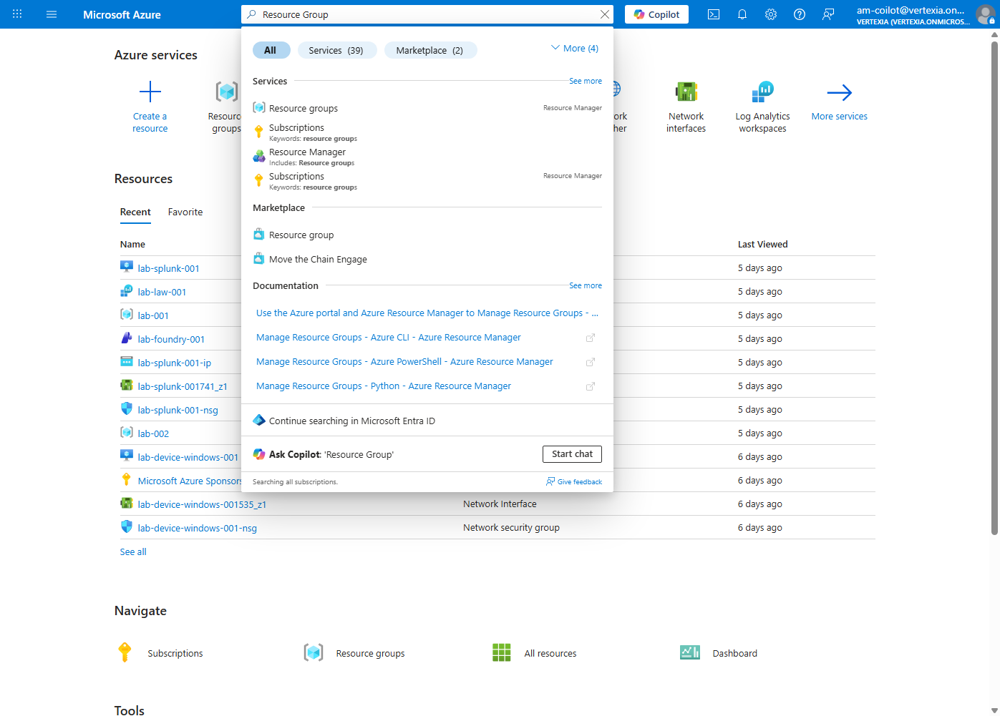

- Click the **+ Create** button.

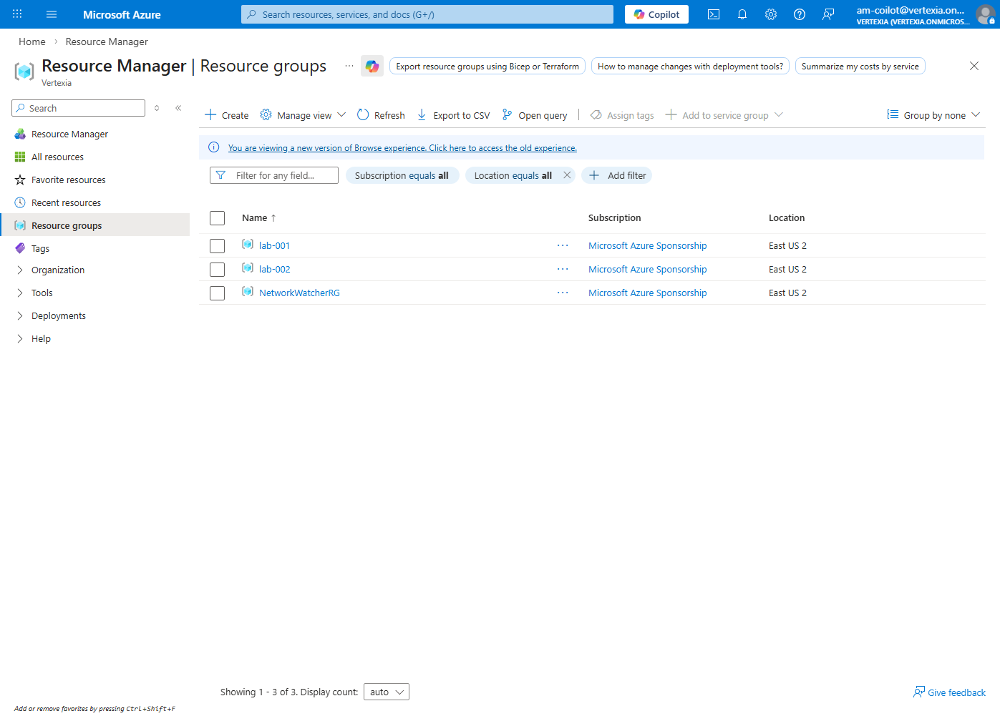

---

**3. Enter Basic Information**

```
Subscription: [Select your subscription]
Resource group: foundry
Region: East US
```

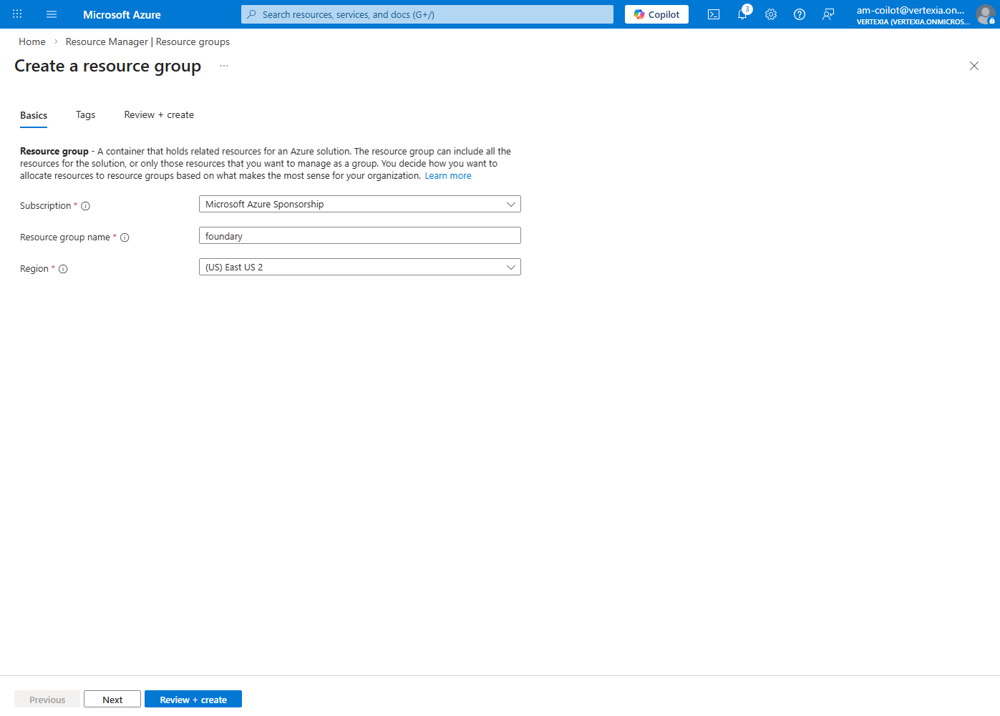

---

**4. Review and Create**

- Click the **Review + create** button.
- After validation is complete, click the **Create** button.

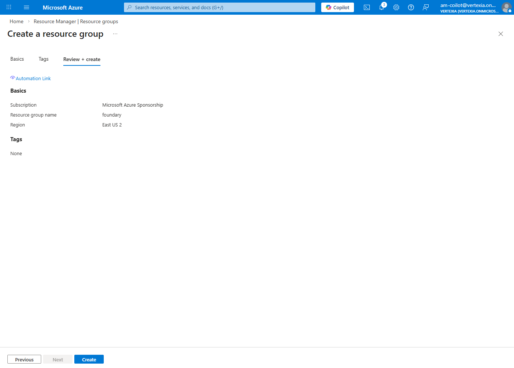

---

### ✅ Verification Checklist

- [ ] Verify the Resource Group was successfully created
- [ ] Resource Group name: `foundry`

---

## Create Foundry Resource

Microsoft Foundry is an integrated platform designed for AI application development and deployment.

### Step-by-Step Guide

**1. Search for Microsoft Foundry Resource**

- Search for **"Microsoft Foundry"** in the Azure Portal top search bar.
- Alternatively, you can directly access the [Microsoft Foundry Portal](https://ai.azure.com).

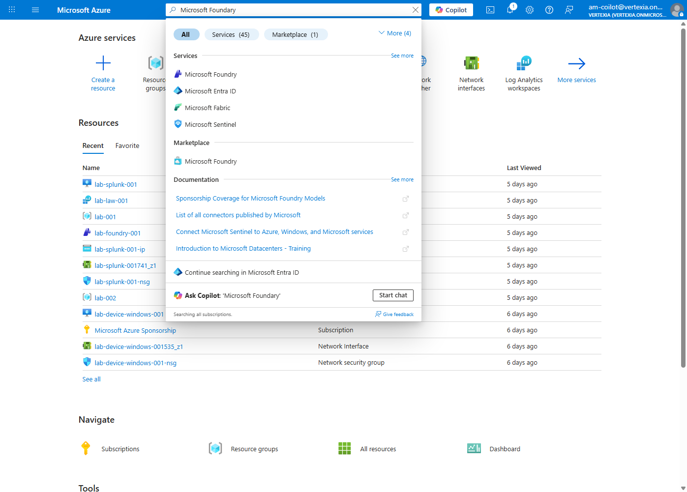

---

**2. Create New Foundry Resource & Project**

- Click the **Create a Foundry Resource** button.

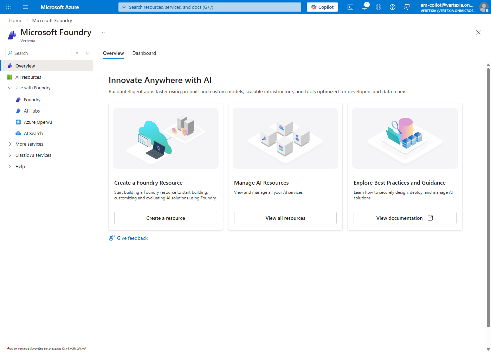

```
Resource group:       foundry
Name:                 foundry-workshop-lab  ⚠️ Remember to change this — name must be unique
Location:             East US
Default project name: proj-default
```

- Enter the required information and create the Foundry resource.
- Click **Review + create**.
- Review all settings and click **Create**.

> ⏳ Resource creation takes approximately **2–5 minutes**.

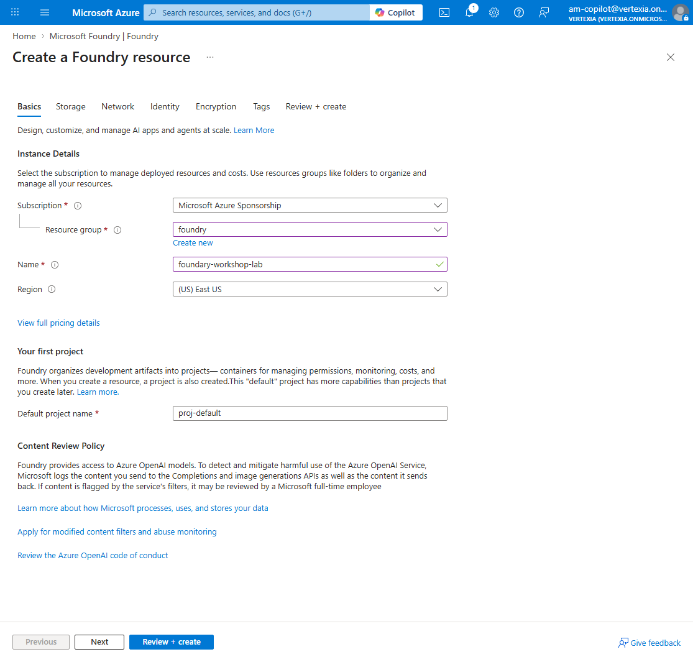

- Navigate to the **Foundry Resource** overview page.

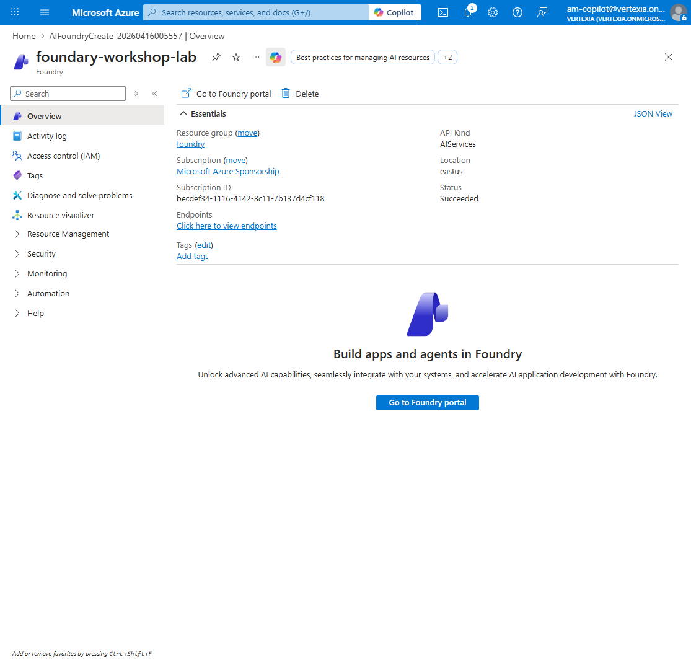

- Click **Go to Foundry portal**.

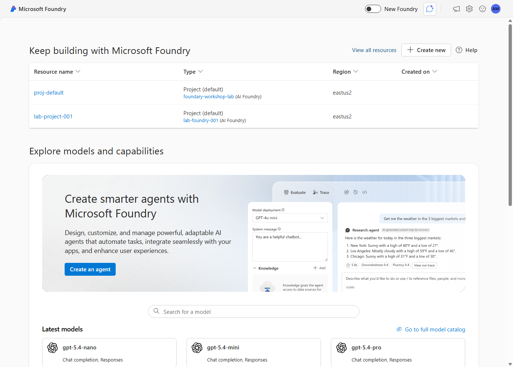

---

### ✅ Verification Checklist

- [ ] Verify the Foundry project was successfully created
- [ ] Project name: `proj-default`

---

## Enable New Foundry Portal

The new Foundry portal offers an enhanced user interface with improved usability and additional features.

### Step-by-Step Guide

**1. Enable New Foundry**

- Find the **"Enable New Foundry"** or **"Try new experience"** option at the top of the portal or in the settings menu.
- Toggle the switch to activate the new interface.

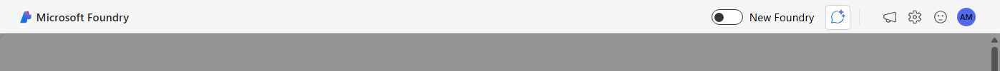

- Choose project `proj-default` and click **Let's go**.

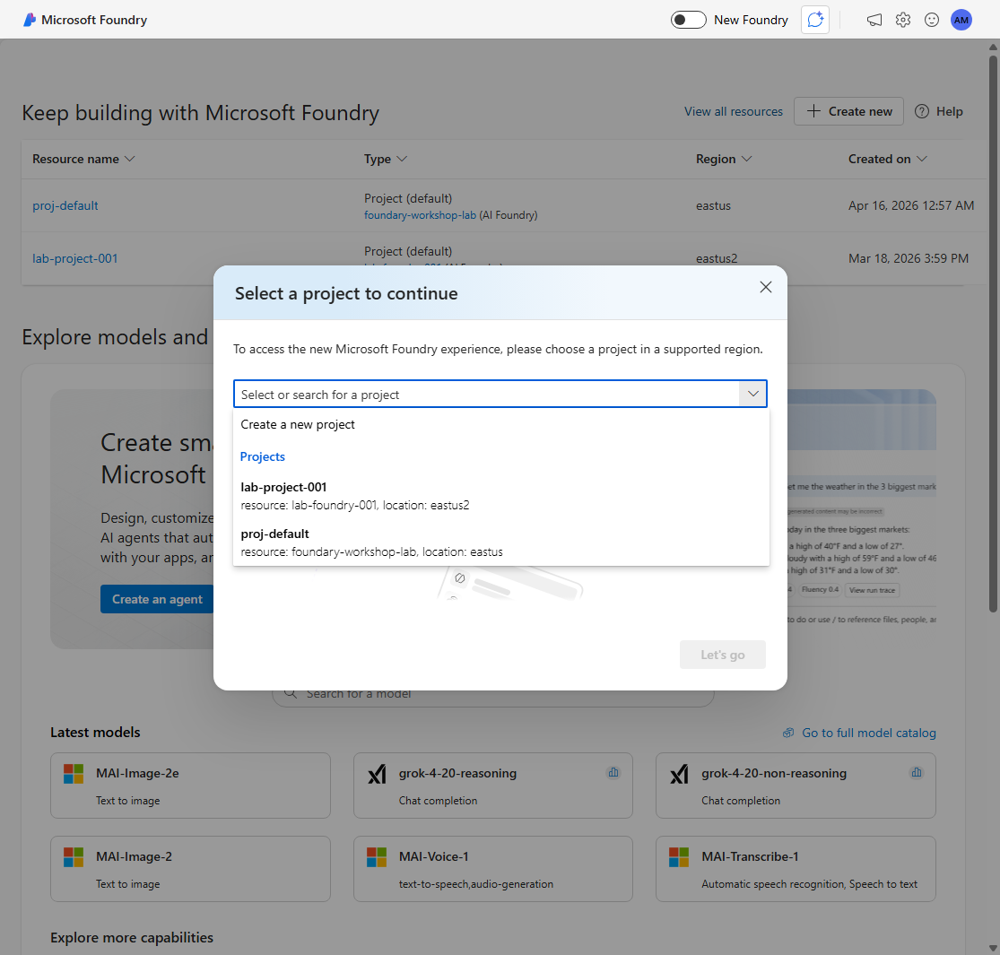

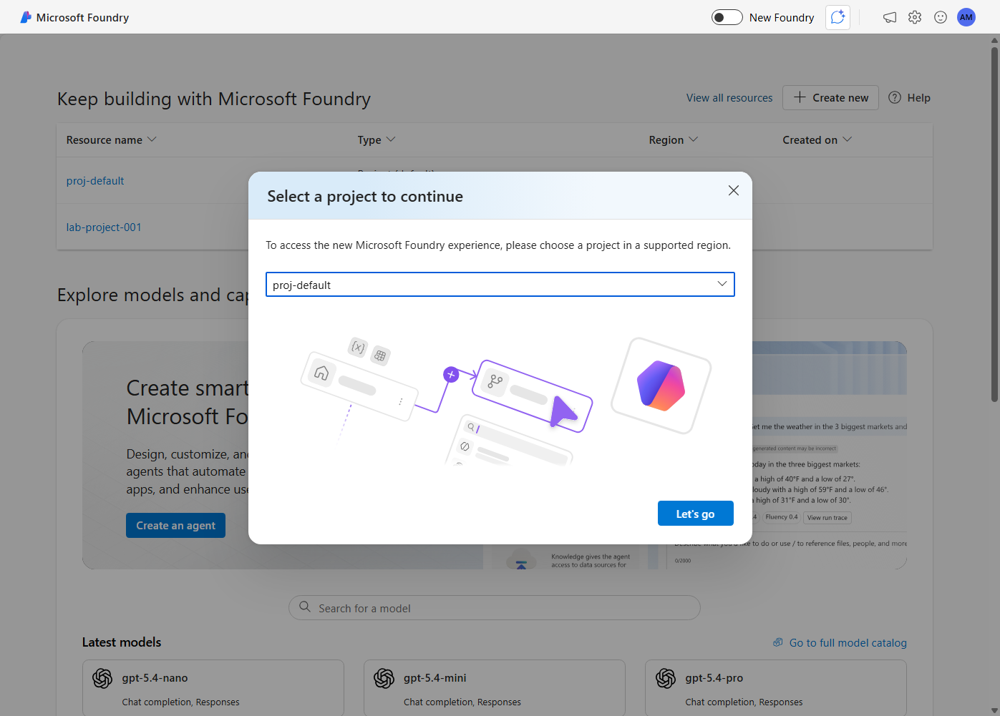

---

**2. Verify Interface**

- Confirm the new portal interface loads.
- Check that you can see the following sections in the top right menu:

| Section     | Description                                      |
|-------------|--------------------------------------------------|
| **Discover** | Explore models, templates, and more             |
| **Build**    | Develop agents, workflows, models, and more     |
| **Operate**  | Manage control plane and more                   |

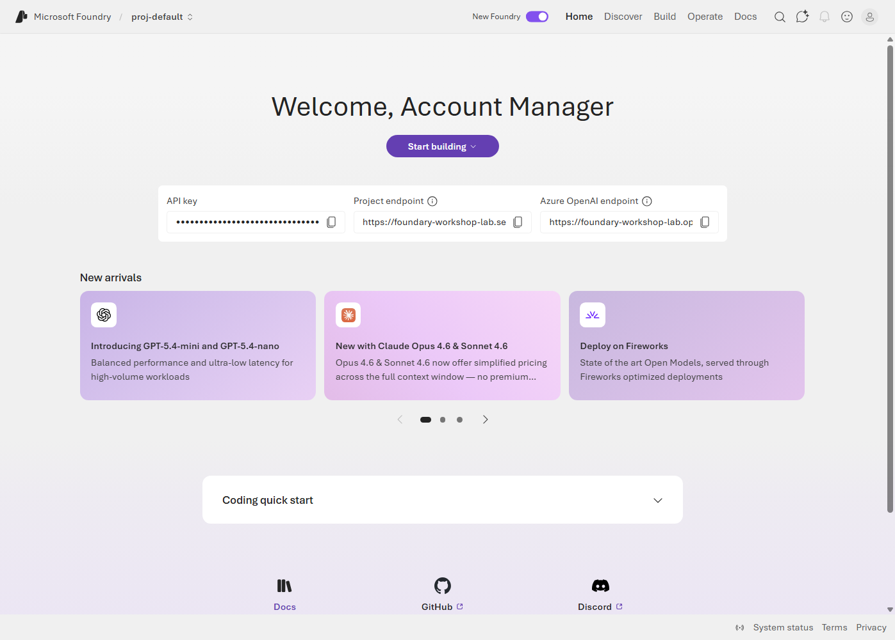

---

## 📚 Additional Resources

- [Microsoft Foundry Documentation](https://learn.microsoft.com/en-us/azure/ai-foundry/what-is-azure-ai-foundry?view=foundry)
- [Azure Resource Manager Overview](https://learn.microsoft.com/en-us/azure/azure-resource-manager/management/overview)
- [Azure Regions and Availability Zones](https://learn.microsoft.com/en-us/azure/reliability/availability-zones-overview)

---

## Next Steps

Environment is setup ! Now let's onboard our first model:

➡️ **[03. Models and Deployment](./3-model.md)**: Create Azure Foundry and deploy base model.

---

[Home](./README.md) | [Next: 03. Models and Deployment](./3-model.md)