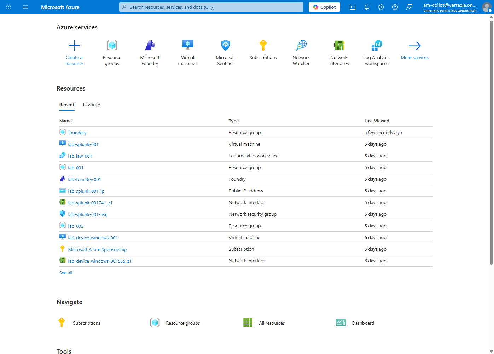
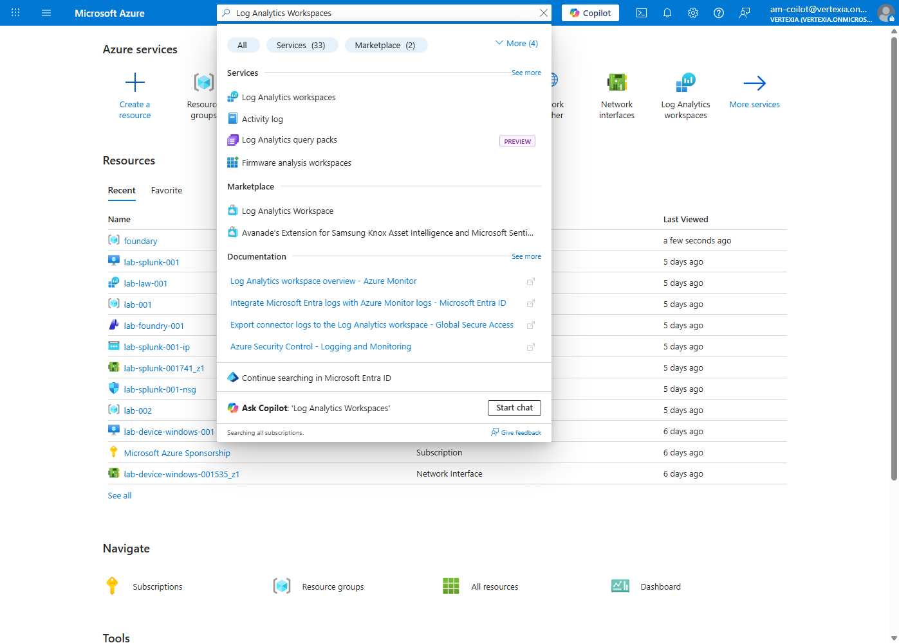
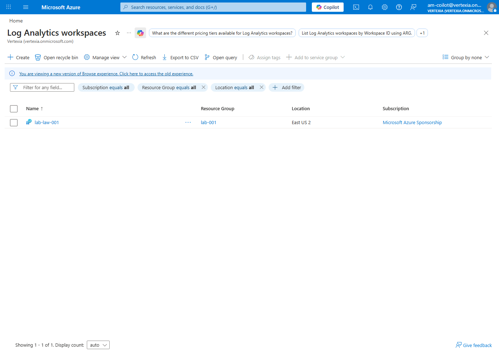
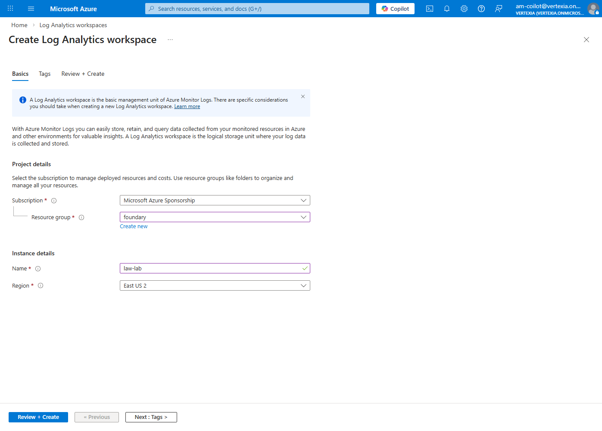
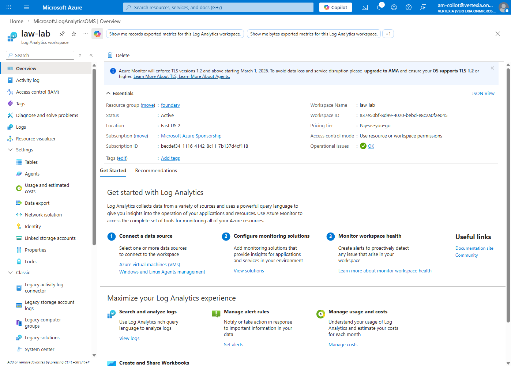
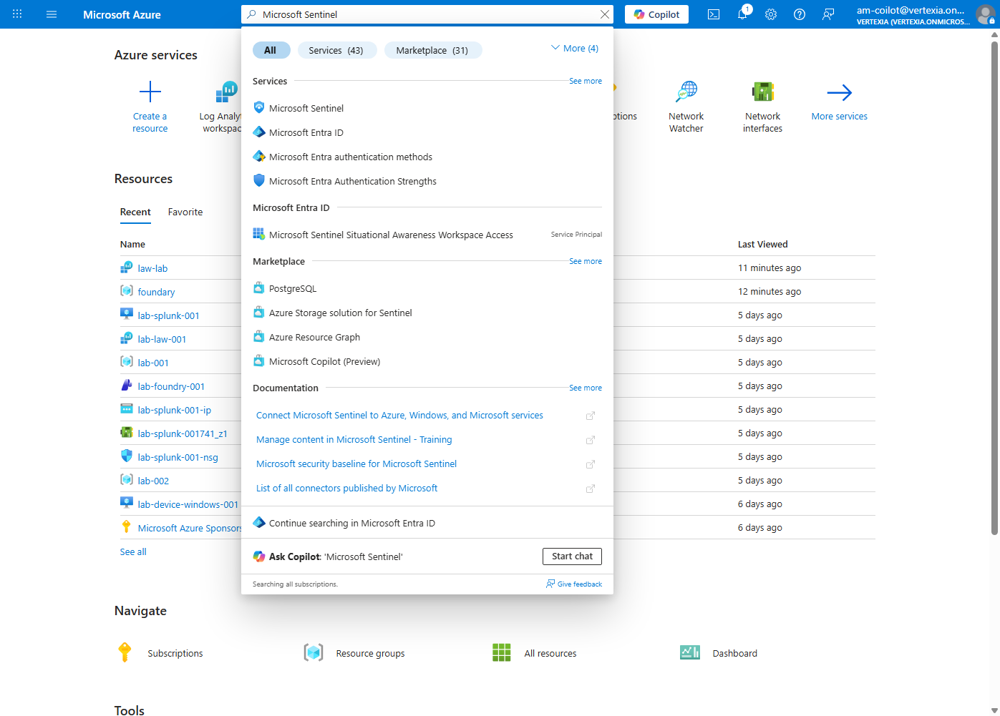
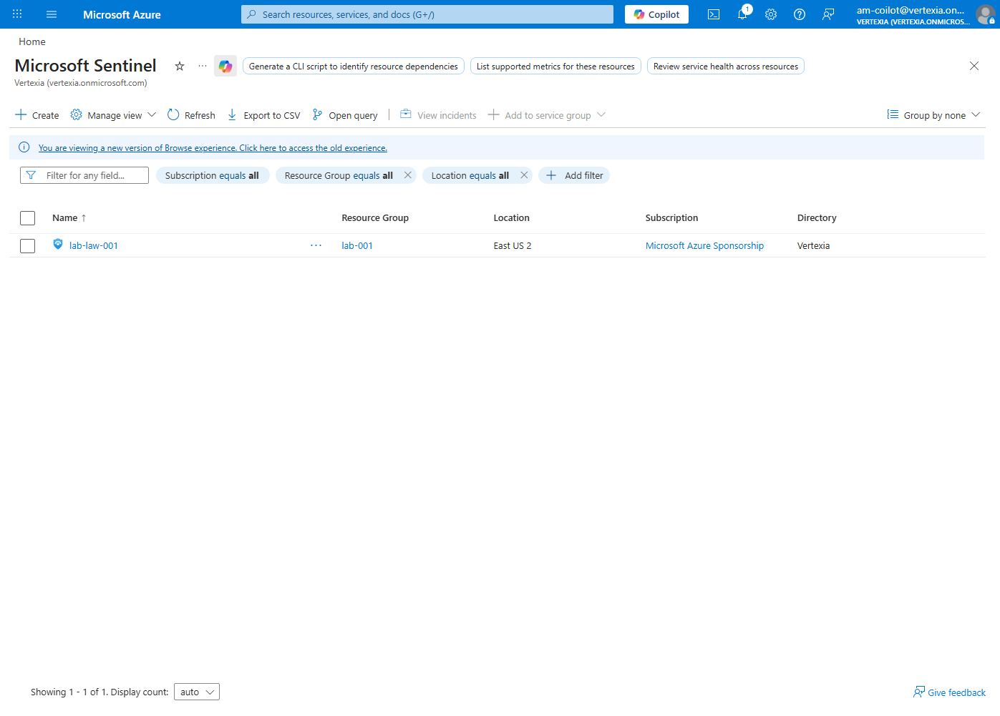
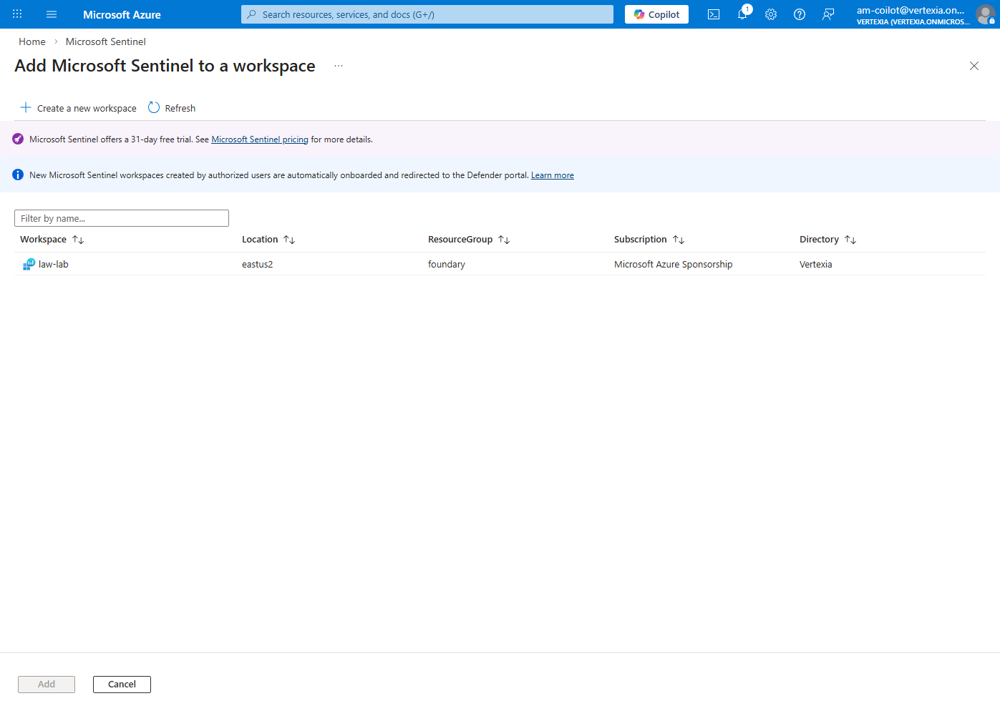
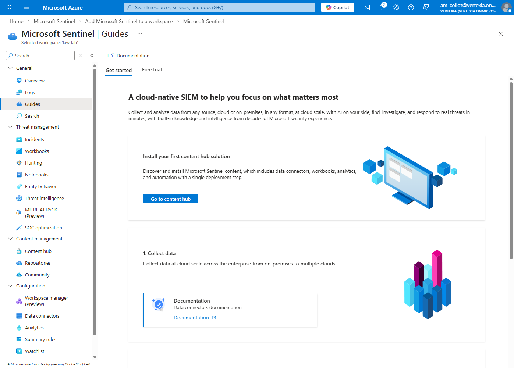

# 02. Microsoft Sentinel Deployment

This module guides you through setting up Microsoft Sentinel, a cloud-native SIEM and SOAR solution, in your Azure environment.

---

## 📋 Table of Contents

- [Create Log Analytics Workspaces](#create-log-analytics-workspaces)
- [Enable Microsoft Sentinel](#enable-microsoft-sentinel)
- [Configure Data Connectors](#configure-data-connectors)
- [Next Steps](#next-steps)

---

## 🎯 Learning Objectives

- Understand the role of Log Analytics Workspace in Sentinel
- Deploy and enable Microsoft Sentinel
- Connect data sources for security monitoring

---

## ⏱️ Estimated Time

Approximately **5–10 minutes**

---

## Create Log Analytics Workspaces

A Log Analytics Workspace is the core data store used by Microsoft Sentinel to collect, analyze, and query logs.

### Step-by-Step Guide

**1. Access Azure Portal**

- Log in to the [Azure Portal](https://portal.azure.com).

---

**2. Create Log Analytics Workspace**

- Search for **"Log Analytics workspaces"** in the top search bar.





- Click the **+ Create** button.



---

**3. Enter Basic Information**

```
Subscription:   [Select your subscription]
Resource group: foundry
Name:           law<Your unique name>
Region:         East US 2
```

- Enter the required information and create the workspace.
- Click **Review + create**.
- Review all settings and click **Create**.

> ⏳ Resource creation takes approximately **2–5 minutes**.



- Go back to **Log Analytics Workspace** and select your workspace name.



---

### ✅ Verification Checklist

- [ ] Workspace created successfully
- [ ] Workspace name: `law-lab`

---

## Enable Microsoft Sentinel

Microsoft Sentinel is enabled on top of a Log Analytics Workspace.

### Step-by-Step Guide

**1. Search for Microsoft Sentinel**

- In the Azure Portal, search for **"Microsoft Sentinel"**.



---

**2. Add Microsoft Sentinel**

- Click **+ Create**.
- Select the previously created workspace: `law-lab`.



- Click **+ Add**.



> ⏳ Resource creation takes approximately **1 minute**.

---

**3. Open Sentinel Dashboard**

- Navigate to the Sentinel overview page.
- Confirm access to the main dashboard.



---

### ✅ Verification Checklist

- [ ] Microsoft Sentinel successfully enabled
- [ ] Workspace connected to Sentinel
- [ ] Sentinel dashboard is accessible