# 03. Models and Deployment

This module teaches you how to explore and deploy various LLM models available through Microsoft Foundry.

## 📋 Table of Contents

- [Discover Models](#discover-models)
- [Compare and Deploy Models](#compare-and-deploy-models)
- [Deploy Embedding Model](#deploy-embedding-model)
- [Next Steps](#next-steps)

## 🎯 Learning Objectives

- Compare model performance using the model leaderboard
- Understand how to deploy various AI models
- Set up and configure Model Router
- Understand model routing strategies

## ⏱️ Estimated Time

Approximately 15 minutes

---

## Discover Models

You can explore various AI models in the Discover section of the Foundry portal.

### Step-by-Step Guide

1. **Navigate to Discover Section**
   - Click **Discover** in the top right menu of the Foundry portal.

   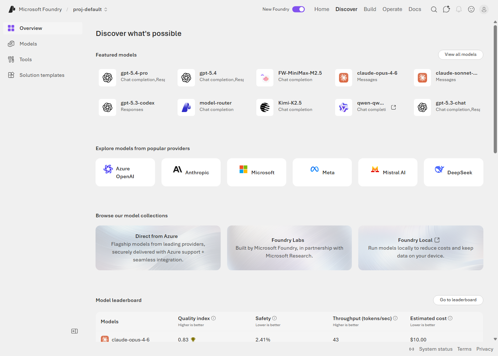

   - Select the **Models** menu.
   
   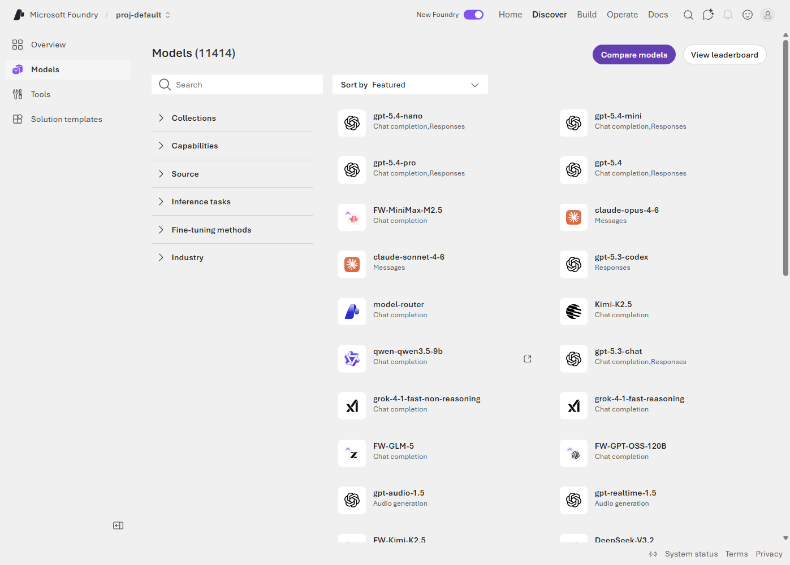

2. **Check Model Leaderboard**
   - Click the **View leaderboard** option.
   - Review performance metrics for various models:
     - Quality scores
     - Latency
     - Cost
     - Context window
     - Modality support (text, vision, audio)
   
   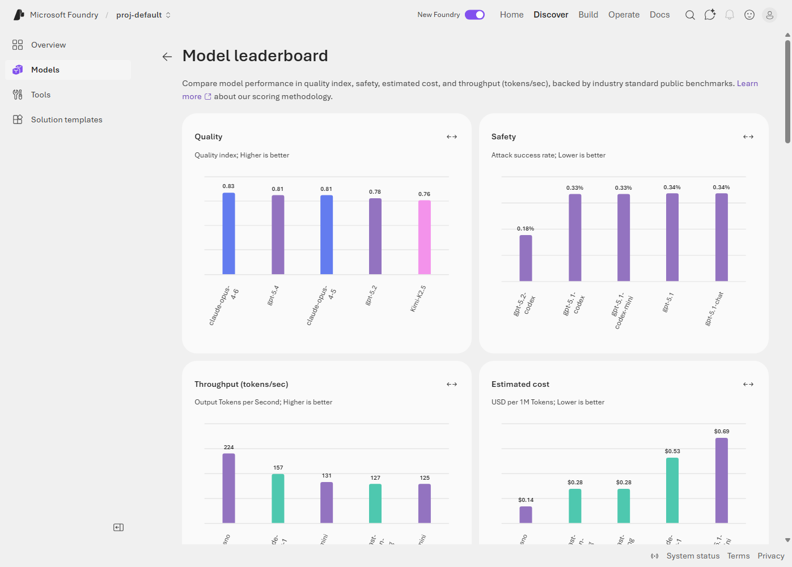

3. **Understand Model Categories**
   - **Language Models**: GPT-5.2, GPT-5, Claude, etc.
   - **Embedding Models**: text-embedding-3-large, text-embedding-ada-002, etc.

### 💡 Tips

- Check the leaderboard regularly for the latest model updates
- Review each model's capabilities and limitations on its detail page

---

## Compare and Deploy Models

### Deploy GPT-5.2 Model

1. **Use Model Comparison Feature**
   - Click the **Compare models** button on the Models page.
   - Select the models you want to compare (e.g., GPT-5.2, GPT-5, Claude 4.5 Sonnet).
   - Compare performance, cost, and features.
   
   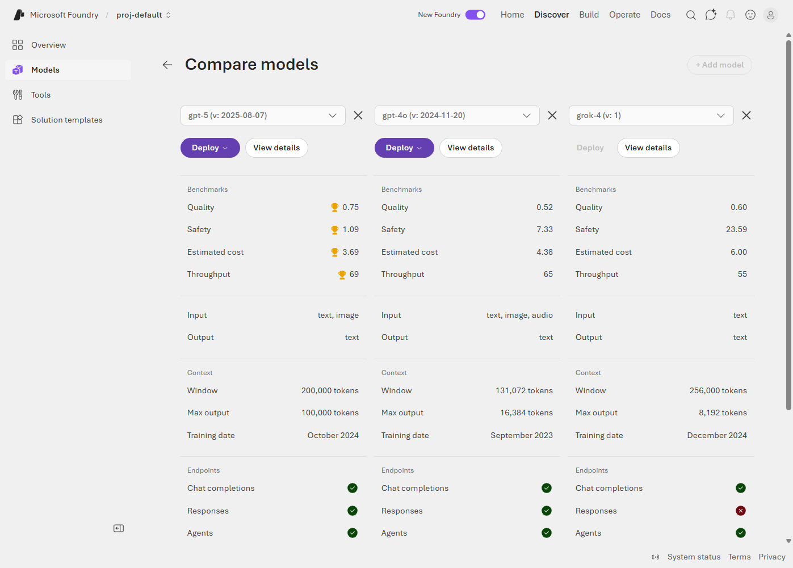

2. **Select and Deploy GPT-5.2**
   - Find **gpt-5.2** in the model list.
   - Click `View details` to view detailed information.
   
   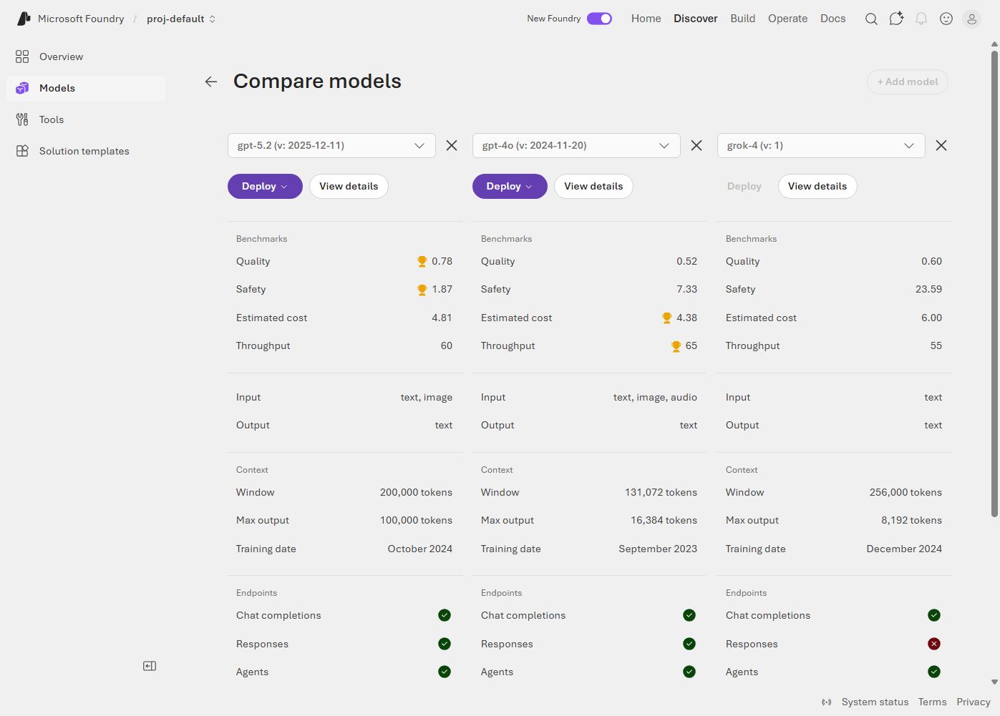

   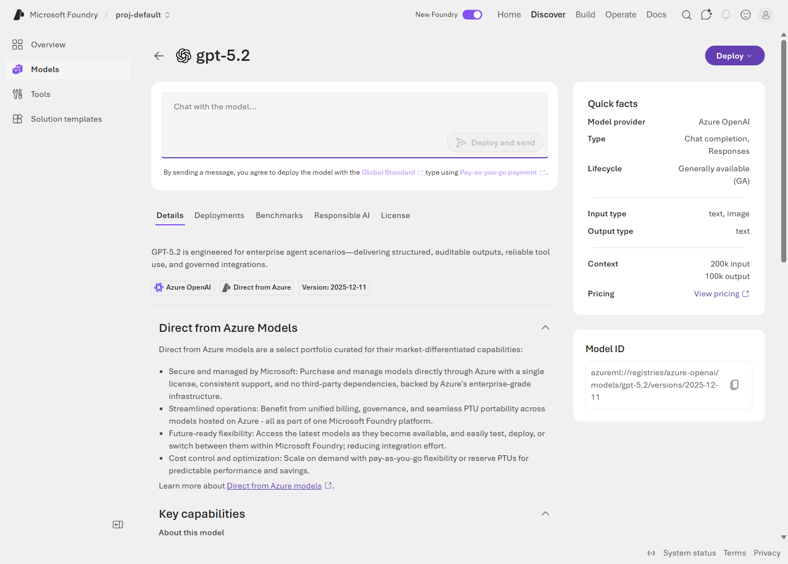

3. **Deployment Configuration**
   - Click `Deploy` to view detailed information.

   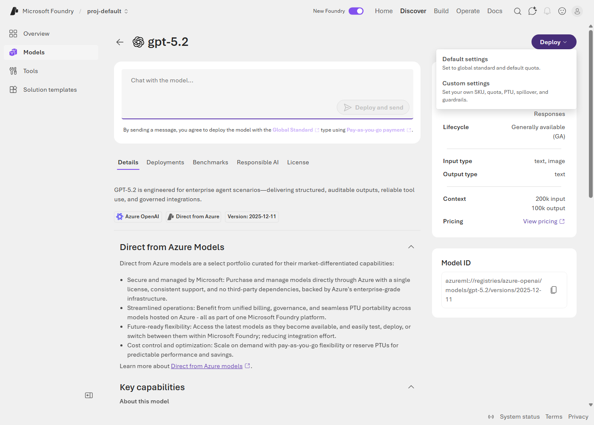

   - Click `Default settings` to deploy model with default settings.

   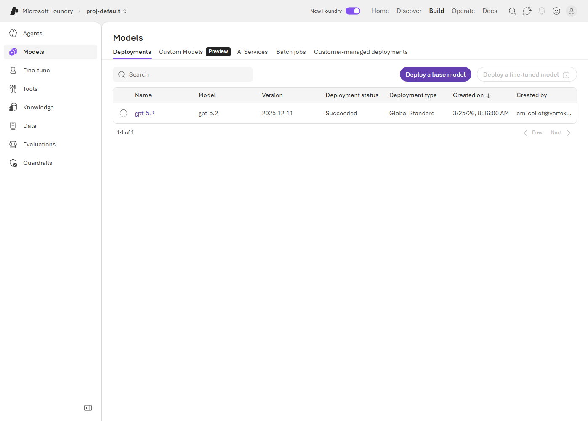

4. **Complete Deployment**
   - Click **Default settings** to start deployment.
   - Deployment takes approximately 1-2 minutes to complete.

### ✅ Verification Checklist

- Verify deployed `gpt-5.2` model in Build > Models section
- Confirm deployment status is "Succeeded"
- Check that Endpoint URL was created

---

## Deploy Embedding Model

Embedding models convert text into vectors, enabling semantic search and similarity calculations.

### Step-by-Step Guide

1. **Search for Embedding Model**
   - Enter **"text-embedding-3"** in the search box on the Discover > Models page.
   - You can use filters to display only Embedding models.
   
   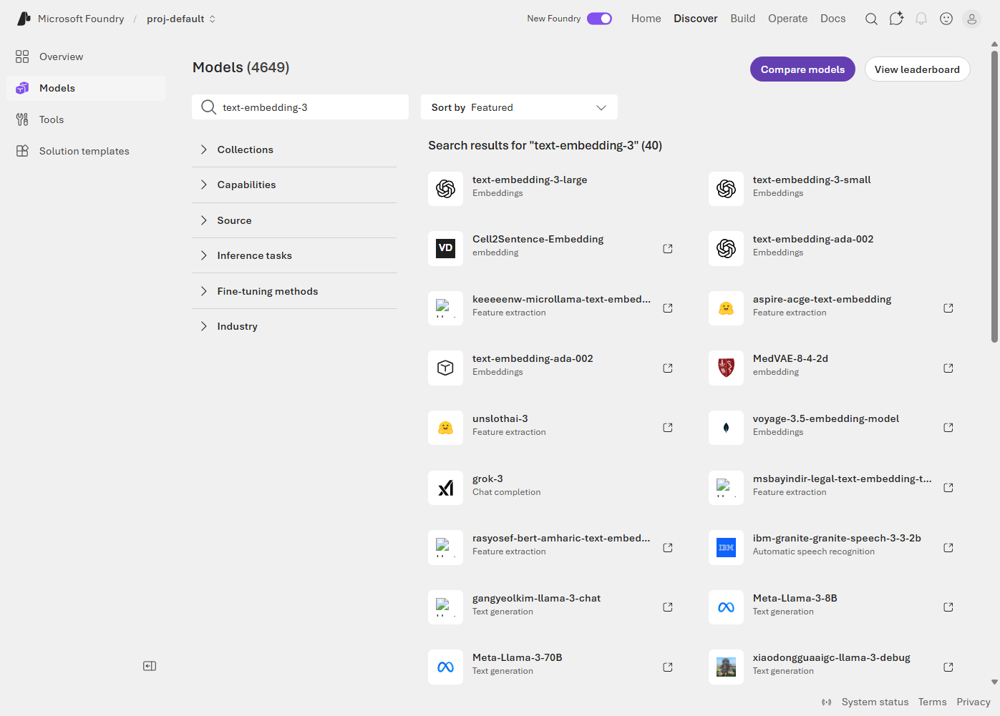

2. **Select text-embedding-3-large**
   - Select the **text-embedding-3-large** model.
   - Review model details:
     - Dimensions: 3072
   
   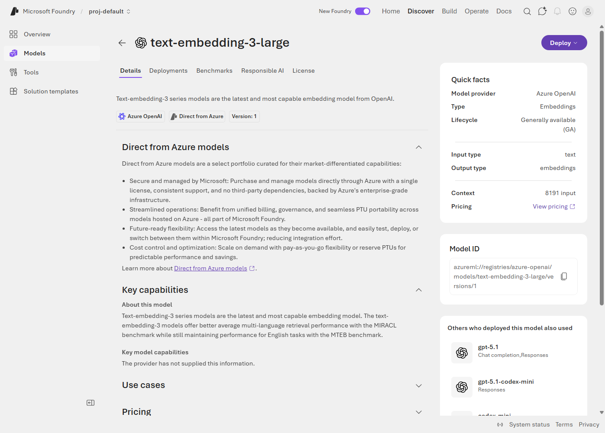

3. **Deployment Configuration**
   ```
   Deployment name: text-embedding-3-large
   Model version: [Latest version]
   Deployment type: Standard
   ```

4. **Execute Deployment**
   - Click the **Deploy** button to deploy.
   
   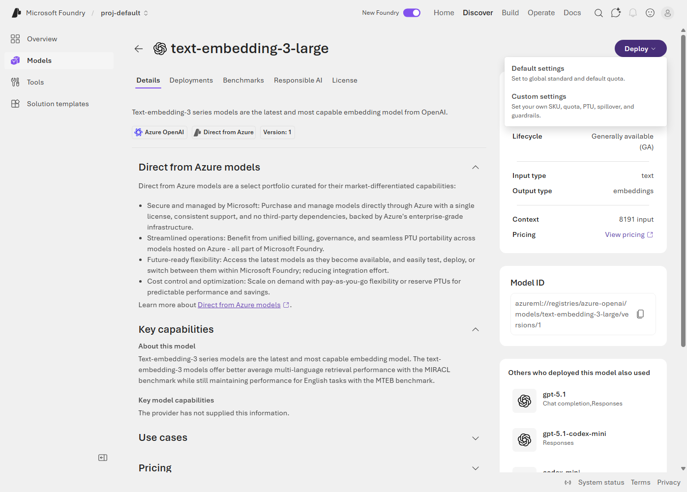

   - Click `Default settings` to deploy model with default settings.

   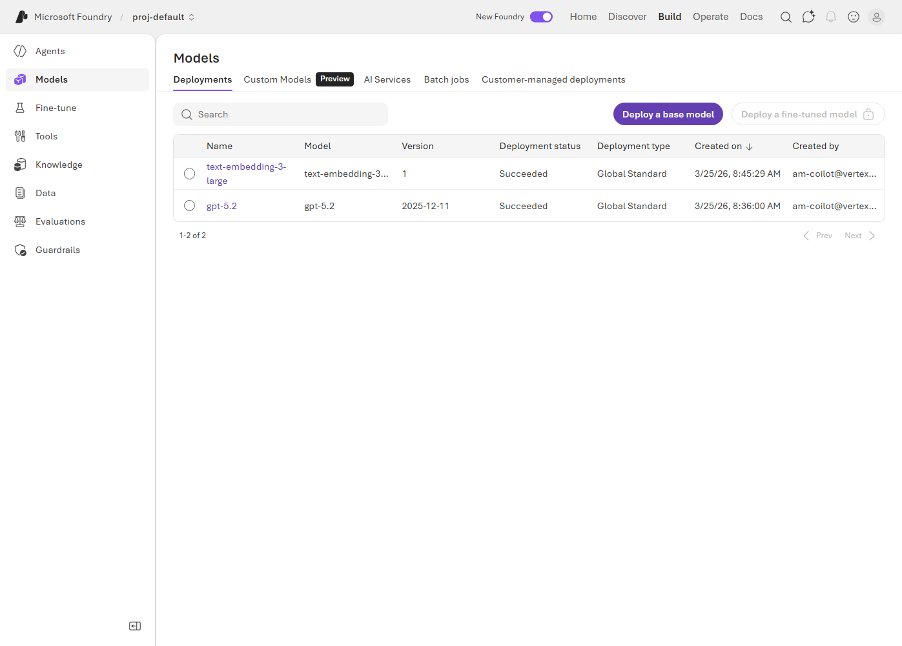

---

## 📚 Additional Resources

- [Model Catalog Guide](https://learn.microsoft.com/en-us/azure/ai-foundry/foundry-models/concepts/models-sold-directly-by-azure?view=foundry&tabs=global-standard-aoai%2Cstandard-chat-completions%2Cglobal-standard&pivots=azure-openai)
- [Model Router Overview](https://learn.microsoft.com/en-us/azure/ai-foundry/openai/concepts/model-router?view=foundry)
- [Embedding Models Guide](https://learn.microsoft.com/en-us/azure/ai-foundry/openai/how-to/embeddings?view=foundry&tabs=python-new)

---

## Next Steps

Model deployment is complete! Now let's build Knowledge base for our agent:

➡️ **[04. Foundry IQ](./4-foundry-iq.md)**: Create knowledge base using CosmosDB and Azure AI Search.

---

[← Previous: 01. Environment Setup](./1-environment.md) | [Home](./README.md) | [Next: 04. Foundry IQ →](./4-foundry-iq.md)
