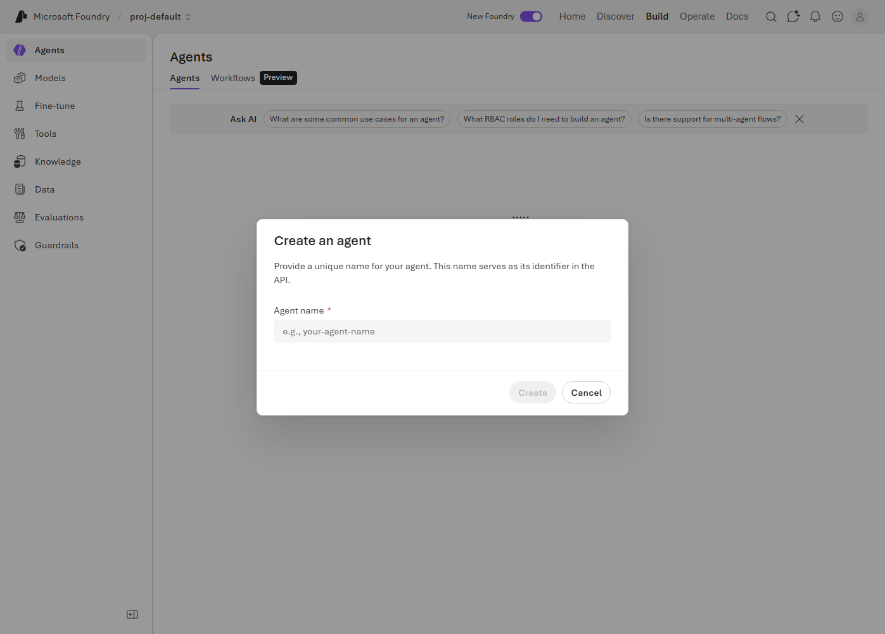
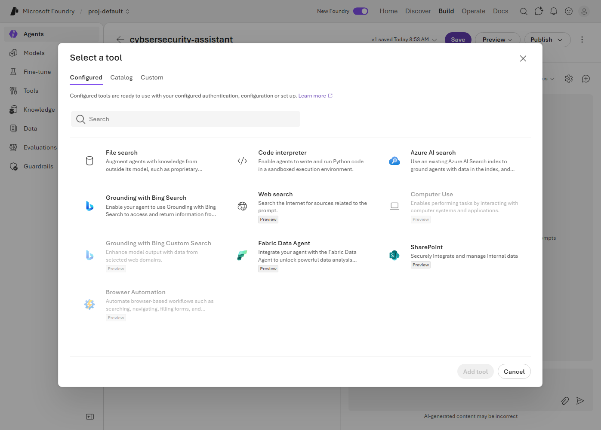
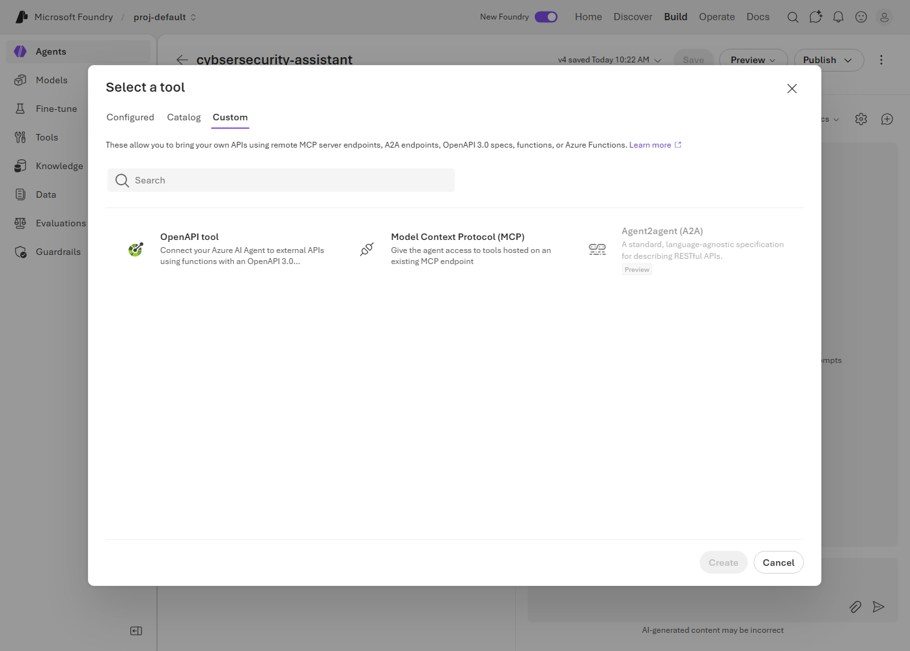
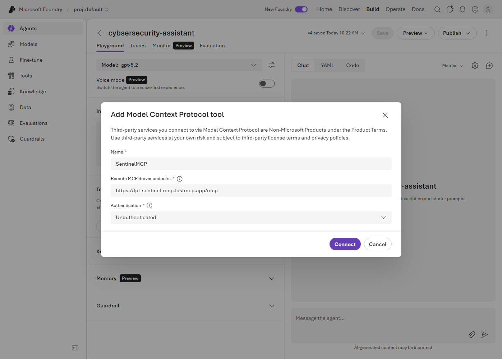
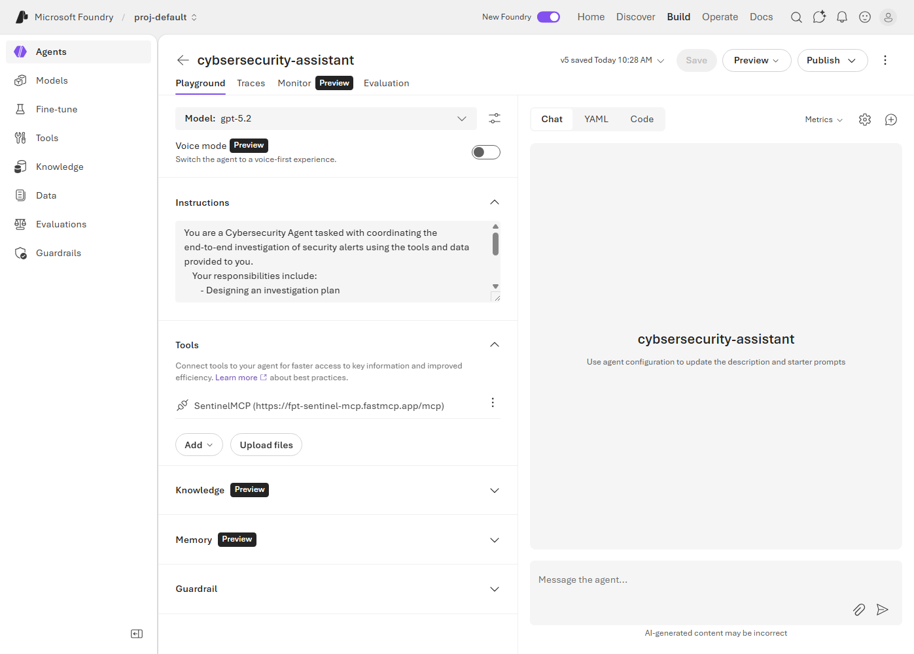
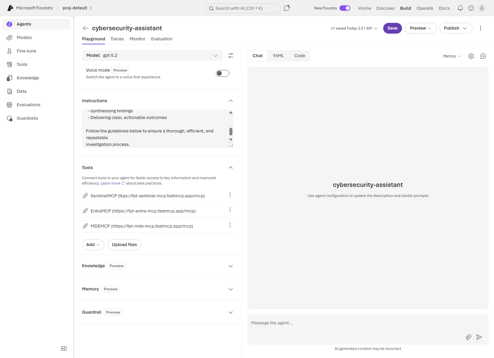
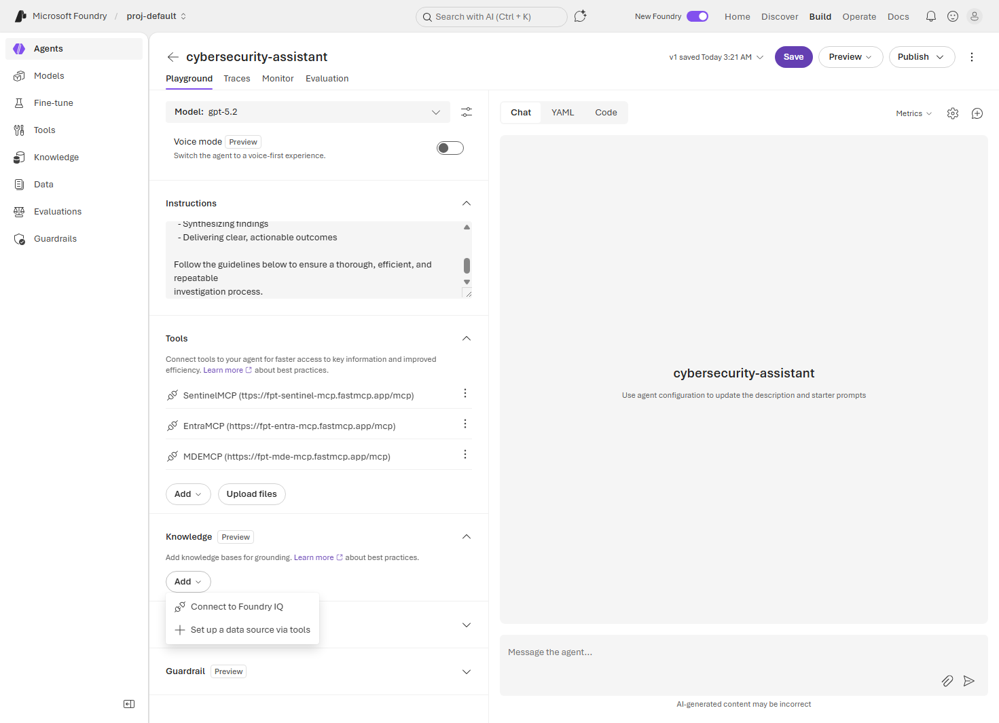
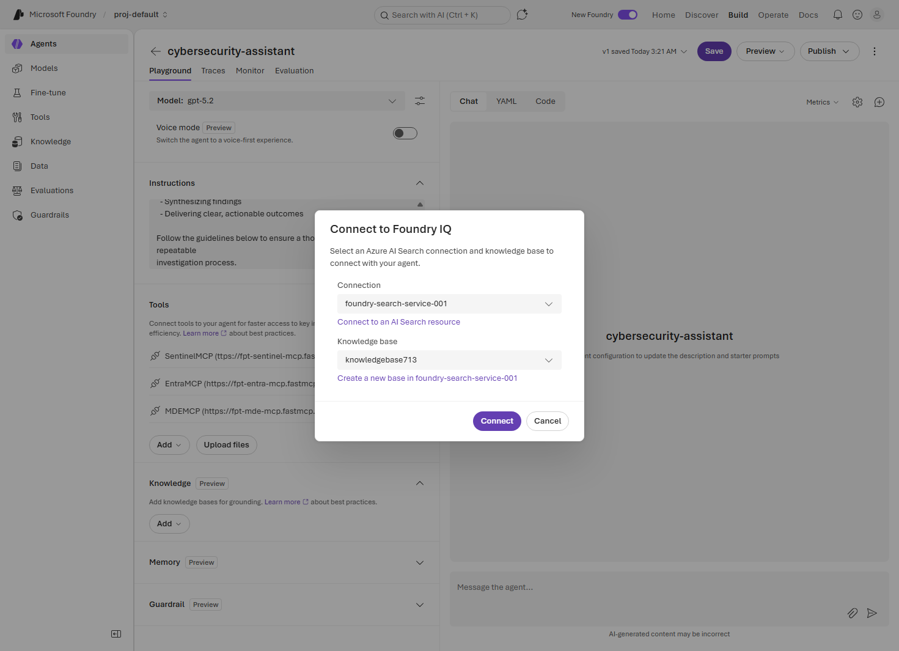
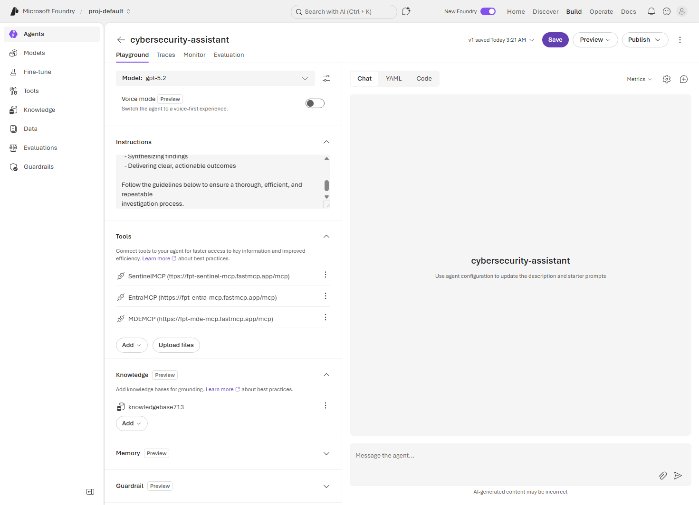

# 05. Agent Development

This module teaches you how to create and deploy AI agents with diverse capabilities and functionalities.

---

## 📋 Table of Contents

- [Agent Overview](#agent-overview)
- [Create Cybersecurity Assistant](#create-cybersecurity-assistant)
- [Deploy and Invoke Agents](#deploy-and-invoke-agents)
- [Next Steps](#next-steps)

---

## 🎯 Learning Objectives

- Understand core concepts of Microsoft Foundry agents
- Create MCP Connection to external services (Microsoft Sentinel)

---

## ⏱️ Estimated Time

Approximately **10 minutes**

---

## Agent Overview

### What is a Microsoft Foundry Agent?

A Microsoft Foundry Agent is an intelligent system that understands user requests and performs tasks using appropriate tools and knowledge.

---

### Key Components

```
Agent = Model + Instructions + Tools + Knowledge
```

| Component | Description |
|---|---|
| **Model** | Base language model (GPT-4.1, Claude, etc.) |
| **Instructions** | Agent behavior guidelines and persona |
| **Tools** | File Search, Web Search, Function Calling, etc. |
| **Knowledge** | Connected knowledge base (Foundry IQ) |

---

### Agent Types

| Type | Description | Use Cases |
|---|---|---|
| **Conversational** | Dialogue-oriented agent | Chatbots, customer support |
| **Task-oriented** | Task-focused agent | Data analysis, document generation |
| **Retrieval-augmented** | Search-based agent | Knowledge base Q&A |
| **Multi-agent** | Multi-agent collaboration | Complex workflows |

---

## Create Cybersecurity Assistant

Create an agent that assists security analysts with alert triage and reporting.

### Step-by-Step Guide

**1. Navigate to Agents Section**

- Select **Build** from the top right menu in the Foundry portal.
- Click the **Agents** menu.


---

**2. Create New Agent**

- Click the **+ Create agent** or **New agent** button.




---

**3. Agent Configuration**

Enter the following basic details:

```
Agent name: cybersecurity-assistant
Model:      gpt-4.1
```

---

**4. Instructions Configuration**

Enter the following instructions for the agent:

```
You are a Cybersecurity Agent tasked with coordinating the end-to-end investigation
of security alerts using the tools and data provided to you.

Your responsibilities include:
  - Designing an investigation plan
  - Delegating subtasks
  - Executing tool commands
  - Synthesizing findings
  - Delivering clear, actionable outcomes

Follow the guidelines below to ensure a thorough, efficient, and repeatable
investigation process.
```

---

**5. Tools Configuration — Add MCP Connections**

- Click the **Add** button under the Tools section.


- Click the **Custom** option.



- Click **Model Context Protocol (MCP)**.



Enter the following details for the first MCP server:

```
Name:                       SentinelMCP
Remote MCP Server Endpoint: https://fpt-sentinel-mcp.fastmcp.app/mcp
Authentication:             Unauthenticated
```

- Click the **Connect** button.





Repeat the same steps to add the following additional MCP servers:

```
Name:                       EntraMCP
Remote MCP Server Endpoint: https://fpt-entra-mcp.fastmcp.app/mcp
Authentication:             Unauthenticated
```

```
Name:                       MdeMCP
Remote MCP Server Endpoint: https://fpt-mde-mcp.fastmcp.app/mcp
Authentication:             Unauthenticated
```



---

**6. Knowledge Base Configuration**

- Expand the **Knowledge** section.



- Select **Connect to Foundry IQ**.



Enter the following details:

```
Connection:     <Your AI Search service resource name>
Knowledge base: <Knowledge base created in the previous module>
```

- Click the **Connect** button.



---

**7. Save Agent**

- Click the **Save** button to save the agent configuration.

---

**8. Test Agent**

Open the **Chat** tab and test the agent with the following prompts:

| Prompt | Expected Behaviour |
|---|---|
| `Who has logged in during the last 3 days?` | Searches user login logs in Microsoft Sentinel |
| `How many endpoint devices do we have in our tenant?` | Searches device information in Microsoft Defender for Endpoint |
| `Analyze and summarize the latest alert` | Combines multiple tools to retrieve and summarize alert data |
| `Draft an alert summary report` | Generates a structured alert summary report using retrieved findings and knowledge|

---

### ✅ Verification Checklist

- [ ] Agent `cybersecurity-assistant` created successfully
- [ ] All three MCP servers connected — `SentinelMCP`, `EntraMCP`, `MDEMCP`
- [ ] Knowledge base connected via Foundry IQ
- [ ] Agent responds correctly to test prompts in the Chat tab